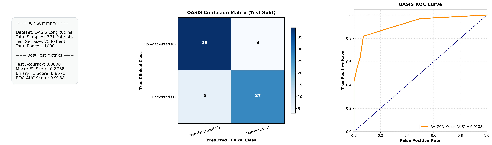

RA-GCN: Graph Convolutional Network for Disease Prediction Problems with Imbalanced Data
====

Here is the code for node classification in graphs with imbalanced classes written in Pytorch.
Ghorbani et.al. "[RA-GCN: Graph Convolutional Network for Disease Prediction Problems with Imbalanced Data](https://arxiv.org/pdf/2103.00221.pdf)" [1]
The aim of this paper is to provide an approach for dealing with graph-based imbalance datasets. The efficiency of this approach has been tested for the graph convolutional network which is introduced by Kipf et al. [2]. 

Usage 
------------
The main file is "main_medical.py".

Input Data
------------
For running the code, you need to change the data load function named "load_data_medical". adjacency matrices, features, labels, training, validation, and test indices should be returned in this function. More description about each variable is as follows:
- adj: is a dictionary with the keys 'D' and 'W'. adj['D'] contains the normalize adjacency matrix (with self-loop) between all nodes and is used for the discriminator. adj['W'] contains a list of normalized adjacency matrices (with self-loop). k-th element is the adjacency matrix between training samples with label k.
- Features: is a tensor that includes the features of all nodes (N by F).
- labels: is a list of labels for all nodes (with length N)
- idx_train, idx_val, idx_test: are lists of indexes for training, validation, and test samples respectively.

Parameters
------------
Here is a list of parameters that should be passed to the main function or set in the code:
- epochs: number of epochs for training the whole network (default: 1000)
- epoch_D: number of epochs for training discriminator in each iteration (default: 1)
- epoch_W: number of epochs for training weighting networks in each iteration (default: 1)
- lr_D: learning for the discriminator (default: 0.01)
- lr_W: common learning rate for all weighting networks (default: 0.01)
- dropout_D: dropout for discriminator (default: 0.5)
- dropout_W: common dropout for all weighting networks (default: 0.5)
- gamma: a float number that shows the coefficient of entropy term in the loss function (default: 1)
- no-cuda: a boolean that can be set to True if using the GPU is not necessary
- structure_D: a list of hidden neurons in each layer of the discriminator. This variable should be set in the code (default: [2] which is a network with one hidden layer with two neurons in it)
- structure_W: a list of hidden neurons in each layer of all the weighting networks. This variable should be set in the code (default: [4])
- drop_epochs: to select the best model, we use the performance of the network on the validation set based on the macro F1 score. To choose the best performance and avoid the network when it is not stabilized yet, we drop a number of epochs at the start of the iterations (default: 500). 

Metrics
------------
Accuracy and macro F1 are calculated in the code. Binary F1 and ROAUC are calculated for binary classification tasks.

Note
------------
Thanks to Thomas Kipf. The code is written based on the "Graph Convolutional Networks in PyTorch" [2].

Bug Report
------------
If you find a bug, please send email to mahsa.ghorbani@sharif.edu including if necessary the input file and the parameters that caused the bug.
You can also send me any comment or suggestion about the program.

References
------------
[1] [Ghorbani, Mahsa, et al. "RA-GCN: Graph convolutional network for disease prediction problems with imbalanced data." Medical Image Analysis 75 (2022): 102272.](https://arxiv.org/pdf/2103.00221)

[2] [Kipf & Welling, Semi-Supervised Classification with Graph Convolutional Networks, 2016](https://arxiv.org/abs/1609.02907)

Cite
------------
Please cite our paper if you use this code in your own work:

@article{ghorbani2022ra,
title={Ra-gcn: Graph convolutional network for disease prediction problems with imbalanced data},
author={Ghorbani, Mahsa and Kazi, Anees and Baghshah, Mahdieh Soleymani and Rabiee, Hamid R and Navab, Nassir},
journal={Medical Image Analysis},
volume={75},
pages={102272},
year={2022},
publisher={Elsevier}
}

Reproduction Notes (nrx17 Fork)
------------
This fork was tested on Windows and Google Colab using Python 3.10.

Compatibility Updates
------------
The original implementation required several modifications to run successfully on a modern Python environment.
The following changes were made:
- Fixed import statements that conflicted with Python's built-in `code` module:
  - from code.model → from model
  - from code.utils → from utils
  - from code.layer → from layer
- Replaced deprecated NumPy usage:
  - np.float → np.float64
- Added a synthetic dataset generation script (`generate_dataset.py`) to recreate the dataset expected by the implementation.

Synthetic Dataset Results
------------
Model: RA-GCN
Dataset file: `data/synthetic/per-90gt-0.5.pkl`

| Metric | Value |
|---------|--------|
| Accuracy | 0.9200 |
| Macro F1 | 0.7778 |
| Binary F1 | 0.6000 |
| ROC-AUC | 0.9064 |

### T4 GPU Optimization for Synthetic Data
| Metric | Value |
|---------|--------|
| Accuracy | 0.9250 |
| Macro F1 | 0.7869 |
| Binary F1 | 0.6154 |
| ROC-AUC | 0.9314 |

OASIS Alzheimer's Disease Experiment
------------
To evaluate the clinical adaptability of RA-GCN, the architecture was systematically evaluated on the real-world **OASIS Longitudinal MRI Dataset**. 

### Dataset Configurations & Preprocessing
- **Clinical Graph Edge Construction:** Patient node similarities are mapped dynamically using normalized Mini-Mental State Examination (MMSE) scores.
- **Node Classification Targets:** Formulated from Clinical Dementia Rating (CDR) metrics (CDR = 0 classified as Nondemented; CDR > 0 classified as Demented).
- **Extracted Structural Features (7 dimensions):** Age, Education level (EDUC), Socioeconomic Status (SES - median imputed), Sex, Estimated Total Intracranial Volume (eTIV), Normalized Whole Brain Volume (nWBV), and Atlas Scaling Factor (ASF). All data tensors are scale-standardized using z-score normalizations.
- **Data Statistics:** 371 total patient vectors (206 Nondemented, 165 Demented). Splitting partitions conform to a 60% Train, 20% Validation, and 20% Test topology (yielding an active unseen test block size of 75 patients).
- **Dataset file:** `data/oasis/oasis_data.pkl`

Definitive Test Performance Metrics
------------
The baseline model achieves stabilized convergence on the clinical graph topology, yielding the following results evaluated exclusively over the unseen test partition:

| Evaluation Metric | Final Test Score Value |
|--------------------|------------------------|
| Test Accuracy | 0.8800 |
| Macro F1-Score | 0.8768 |
| Binary F1-Score | 0.8571 |
| ROC Area Under Curve (AUC) | 0.9188 |

========Results==========
acc test : 0.88
f1Macro test : 0.8768472906403941
f1Binary test : 0.8571428571428571
AUC test : 0.9188311688311689

Automated Evaluation Dashboard Visualizations
------------
The training script now automatically saves execution results directly to a 3-panel, publication-ready metric dashboard graphic named `evaluation_dashboard.png`. 

This layout contains:
1. **Run Summary Meta-Panel:** Details sample split properties, dimensions, tracking metrics, and historical metadata.
2. **Clinical Confusion Matrix:** Illustrates classification decisions, cross-referencing True Classes against Predicted Choices across the 75 test patients.
3. **ROC Performance Curve:** Maps out Sensitivity (True Positive Rate) against False Positive thresholds, annotating the definitive final Area Under the Curve (AUC) index score.

